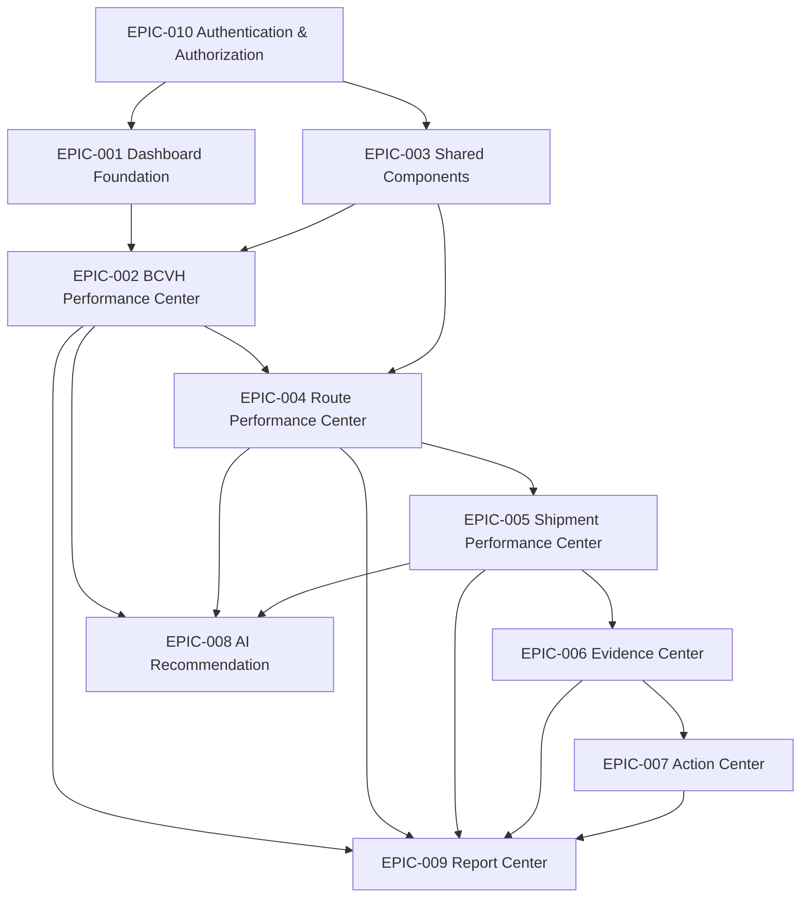

# Epic Planning

## 1. Epic Structure

### EPIC-001 Dashboard Foundation

- Epic Name: Dashboard Foundation
- Business Goal: Establish the executive entry point and shared shell for QIS V2.
- Business Value: Provides the first stable release surface for leaders.
- Scope: Dashboard shell, shared navigation, base KPI blocks, context handoff.
- Related Modules: Dashboard
- Dependency: SSOT, Implementation Architecture
- Release: V2.0 Foundation
- Priority: High
- Estimated Complexity: Medium
- Acceptance Criteria: Dashboard renders on frozen contracts and preserves context.
- Definition of Done: Dashboard foundation is implemented, validated, and ready for downstream centers.

### EPIC-002 BCVH Performance Center

- Epic Name: BCVH Performance Center
- Business Goal: Deliver the BCVH executive analytical center.
- Business Value: Gives leaders a reliable BCVH decision view.
- Scope: BCVH analysis, priority, trend, root cause, recommendation, drill-down.
- Related Modules: BCVH Performance Center
- Dependency: EPIC-001, frozen BCVH contracts
- Release: V2.0 Foundation
- Priority: High
- Estimated Complexity: High
- Acceptance Criteria: BCVH center operates on frozen data and follows approved UX/architecture.
- Definition of Done: BCVH center is complete and integrated with the dashboard context.

### EPIC-003 Shared Components

- Epic Name: Shared Components
- Business Goal: Standardize reusable UI building blocks.
- Business Value: Reduces duplication and keeps design consistency.
- Scope: Cards, tables, badges, charts, timelines, filter bar, drill-down controls, states.
- Related Modules: Shared frontend foundation
- Dependency: EPIC-001, QIS Design System
- Release: V2.0 Foundation
- Priority: High
- Estimated Complexity: High
- Acceptance Criteria: Shared components comply with design system and support center pages.
- Definition of Done: Shared component library is delivered and adopted by baseline pages.

### EPIC-004 Route Performance Center

- Epic Name: Route Performance Center
- Business Goal: Deliver route-level impact analysis and drill-down.
- Business Value: Helps leaders isolate problem routes quickly.
- Scope: Route analysis, trend, root cause, recommendation, shipment drill-down.
- Related Modules: Route Performance Center
- Dependency: EPIC-002, EPIC-003
- Release: V2.1 Decision Support
- Priority: High
- Estimated Complexity: High
- Acceptance Criteria: Route center consumes frozen contracts and preserves BCVH context.
- Definition of Done: Route center is operational and connected to the BCVH journey.

### EPIC-005 Shipment Performance Center

- Epic Name: Shipment Performance Center
- Business Goal: Deliver shipment-level analysis and evidence entry points.
- Business Value: Enables leaders to identify concrete shipment cases behind issues.
- Scope: Shipment impact, timeline, evidence summary, recommendation, drill-down.
- Related Modules: Shipment Performance Center
- Dependency: EPIC-004
- Release: V2.1 Decision Support
- Priority: High
- Estimated Complexity: High
- Acceptance Criteria: Shipment center supports drill-down from route and exposes required evidence context.
- Definition of Done: Shipment center is complete and integrated with route context.

### EPIC-006 Evidence Center

- Epic Name: Evidence Center
- Business Goal: Verify the evidence base before decisions and actions.
- Business Value: Increases trust and traceability in operational analysis.
- Scope: Evidence coverage, validation, supporting evidence, RCA evidence, decision support.
- Related Modules: Evidence Center
- Dependency: EPIC-005
- Release: V2.1 Decision Support
- Priority: High
- Estimated Complexity: High
- Acceptance Criteria: Evidence center can validate and summarize supporting evidence without creating new business rules.
- Definition of Done: Evidence center is available for decision verification.

### EPIC-007 Action Center

- Epic Name: Action Center
- Business Goal: Convert decisions into trackable actions and feedback.
- Business Value: Closes the execution loop and improves accountability.
- Scope: Decision queue, ownership, action tracking, feedback, history.
- Related Modules: Action Center
- Dependency: EPIC-006
- Release: V2.1 Decision Support
- Priority: High
- Estimated Complexity: High
- Acceptance Criteria: Action center supports ownership, execution tracking, and feedback capture.
- Definition of Done: Action center is available for operational follow-through.

### EPIC-008 AI Recommendation

- Epic Name: AI Recommendation Engine
- Business Goal: Provide AI-assisted recommendation and insight support.
- Business Value: Improves analysis speed and recommendation quality.
- Scope: Recommendation support, confidence, explanation, advisory enrichment.
- Related Modules: AI Recommendation
- Dependency: EPIC-002, EPIC-004, EPIC-005, SSOT approval
- Release: V2.2 AI Intelligence
- Priority: Medium
- Estimated Complexity: High
- Acceptance Criteria: AI outputs remain advisory and do not override frozen business rules.
- Definition of Done: AI support is integrated where approved and controlled.

### EPIC-009 Report Center

- Epic Name: Report Center
- Business Goal: Provide consolidated reporting and export capability.
- Business Value: Enables operational review and executive summarization.
- Scope: Consolidated report views, exports, reporting workflows.
- Related Modules: Report Center
- Dependency: EPIC-002 through EPIC-007
- Release: V2.3 Operational Excellence
- Priority: Medium
- Estimated Complexity: Medium
- Acceptance Criteria: Report outputs reflect upstream center data and remain consistent with SSOT.
- Definition of Done: Report Center is available for operational and executive reporting.

### EPIC-010 Authentication & Authorization

- Epic Name: Authentication & Authorization
- Business Goal: Protect QIS V2 access and enforce role-based entry.
- Business Value: Ensures only authorized users can access sensitive operational data.
- Scope: Login, session, role, permission, access guard.
- Related Modules: Shared security foundation
- Dependency: SSOT access rules, implementation stack
- Release: V2.0 Foundation
- Priority: High
- Estimated Complexity: Medium
- Acceptance Criteria: Users are authenticated and authorized before entering center flows.
- Definition of Done: Security foundation is in place for all future modules.

## 2. Release Alignment

### V2.0 Foundation

- EPIC-010 Authentication & Authorization
- EPIC-003 Shared Components
- EPIC-001 Dashboard Foundation
- EPIC-002 BCVH Performance Center

### V2.1 Decision Support

- EPIC-004 Route Performance Center
- EPIC-005 Shipment Performance Center
- EPIC-006 Evidence Center
- EPIC-007 Action Center

### V2.2 AI Intelligence

- EPIC-008 AI Recommendation

### V2.3 Operational Excellence

- EPIC-009 Report Center

## 3. Dependency Graph

## 4. Parallel Development Opportunities

- EPIC-010 can start immediately with implementation scaffolding.
- EPIC-003 can run in parallel with EPIC-001.
- EPIC-002 can run after shared shell foundations are stable.
- EPIC-004 and EPIC-005 can proceed in sequence, with some backend and frontend preparation in parallel.
- EPIC-006 and EPIC-007 can start after shipment and evidence contracts are stable.
- EPIC-008 can run in parallel with decision support after core center data is ready.
- EPIC-009 should wait until upstream center outputs stabilize.

## 5. Planning Notes

- Epic order follows release order.
- High-priority epics are concentrated in V2.0 and V2.1.
- AI and reporting are intentionally deferred to later releases to protect foundation quality.
- Security is treated as a prerequisite epic because it is shared by every module.

