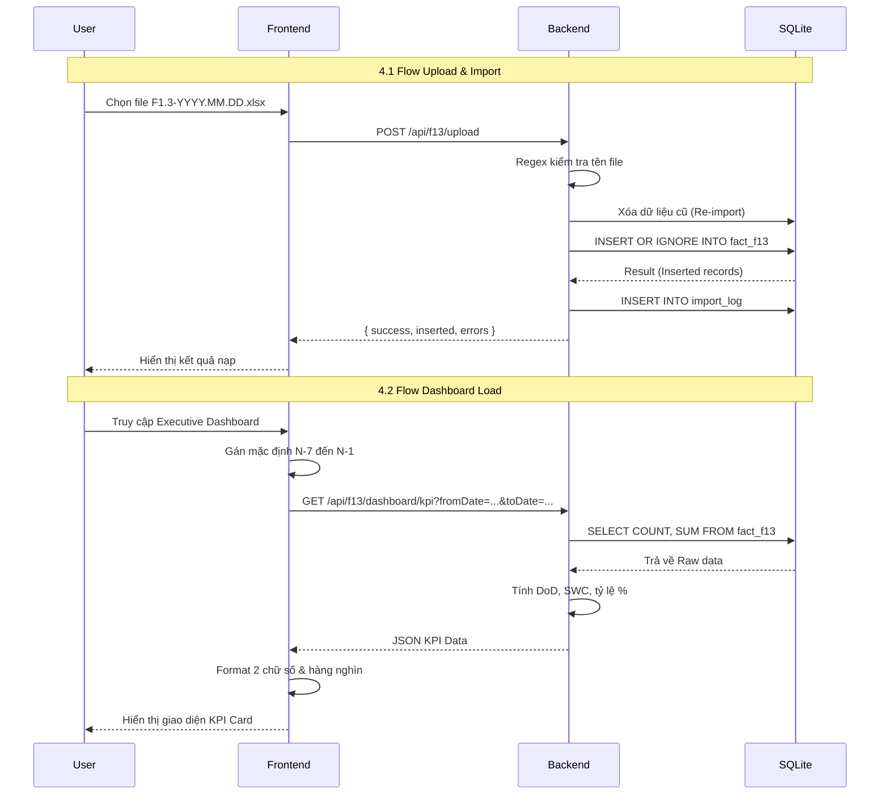

# F1.3 Technical Design v1.0 (Iteration 1: M0 + M1)

Tài liệu này định nghĩa thiết kế kỹ thuật phục vụ cho Iteration 1 (M0: Data Import Processing + M1: Executive Dashboard). Thiết kế tham chiếu 100% từ SSOT Documentation F1.3. Tuyệt đối không chứa Business Logic tự tạo.

## 1. Database Design (SQLite)

### 1.1 Schema `fact_f13`
Bảng lưu trữ dữ liệu chi tiết Bưu gửi, tham chiếu `data_blueprint.md`.

| Column | Type | Nullable | Ghi chú |
|---|---|---|---|
| `ma_bg` | TEXT | No | Số hiệu Bưu gửi |
| `ma_bcvh` | TEXT | No | Mã BC phát |
| `ten_bcvh` | TEXT | No | Tên BC phát |
| `ma_tuyen` | TEXT | Yes | Mã Tuyến phát |
| `ten_tuyen` | TEXT | Yes | Tên Tuyến phát |
| `ket_qua_f13` | TEXT | No | Đánh giá (Đạt/Không đạt) |
| `thoi_gian_ptc` | TEXT | Yes | Thời gian Phát thành công (ISO 8601) |
| `thoi_gian_nop_tien`| TEXT | Yes | Thời gian Nộp tiền (ISO 8601) |
| `ngay_do_kiem` | TEXT | No | Ngày đo kiểm (Trích xuất từ Tên file YYYY-MM-DD) |

*(Lưu ý: Mặc dù file Excel có 41 cột, thiết kế DB sẽ tạo đủ 41 cột hoặc lưu dạng JSON cho các cột mở rộng, MVP sẽ thao tác trên các cột cốt lõi trên theo `data_blueprint.md`)*.

### 1.2 Schema `import_log`
Bảng lưu trữ lịch sử nạp dữ liệu.
- `id` (INTEGER, PK, AI)
- `file_name` (TEXT, Tên file nạp)
- `ngay_do_kiem` (TEXT)
- `status` (TEXT: SUCCESS, FAILED)
- `total_records` (INTEGER - Tổng số bản ghi hợp lệ từ file)
- `error_records` (INTEGER - Lỗi thực sự như validation, DB error)
- `skipped_records` (INTEGER - Số dòng bị bỏ qua do duplicate)
- `created_at` (DATETIME)

### 1.3 Constraints & Indexes
- **Constraint**: `UNIQUE(ngay_do_kiem, ma_bg)` - Ngăn chặn Duplicate theo đúng `data_blueprint.md`.
- **Index 1**: `idx_ngay_do_kiem` trên `(ngay_do_kiem)` để tối ưu hóa truy vấn Dashboard theo ngày.
- **Index 2**: `idx_bcvh_ngay` trên `(ma_bcvh, ngay_do_kiem)`.

---

## 2. Backend Design (Node.js/Express)

### 2.1 Backend Services
- **`importProcessor.js`**: Xử lý logic Re-import (Ghi đè) và Duplicate Protection. Sử dụng `INSERT OR IGNORE INTO fact_f13` để bỏ qua các dòng vi phạm Unique Constraint mà không Rollback toàn bộ file. Tính toán phân loại: `skipped_records` = `total_parsed` - `total_inserted`.
- **`excelParser.js`**: Đọc file bằng thư viện `xlsx`, map tĩnh 41 cột theo cấu hình chuẩn, bắt lỗi nếu không tìm thấy cột `Số hiệu bưu gửi`.
- **`kpiController.js`**: Truy vấn và tính toán các metric (Tổng Bưu gửi, Bưu gửi Đạt/Không đạt, Tỷ lệ Không đạt, DoD, SWC). 

### 2.2 API Contracts (RESTful)

#### API 1: Nạp dữ liệu
- **Endpoint**: `POST /api/f13/upload`
- **Request**: `multipart/form-data` (file: `F1.3-YYYY.MM.DD.xlsx`)
- **Response**: `{ success: boolean, total: number, inserted: number, skipped: number, errors: number }`

#### API 2: Lấy số liệu Executive Dashboard
- **Endpoint**: `GET /api/f13/dashboard/kpi`
- **Params**: `fromDate`, `toDate`, `ma_bcvh`
- **Response**:
```json
{
  "success": true,
  "data": {
    "today": 95.45,
    "yesterday": 94.20,
    "dod": 1.25,
    "swc": -0.5,
    "tong_buu_gui": 1500,
    "buu_gui_dat": 1431,
    "buu_gui_khong_dat": 69
  }
}
```

### 2.3 Error Handling
- Bắt lỗi sai định dạng tên file (Regex check).
- Bắt lỗi thiếu cột bắt buộc.
- Trả về HTTP 400 Bad Request cho lỗi Validation, 500 Internal Server Error cho DB Error.

---

## 3. Frontend Design (React)

### 3.1 Component Structure
- `F13Dashboard` (Page Layout)
  - `TimeFilter` (Mặc định N-7 đến N-1 theo `business_rules.md`)
  - `BcvhFilter`
  - `KpiCards` (Hiển thị các chỉ số M1)
  - `TrendChart`

### 3.2 State Flow & Filter Flow
- **Global State / URL Search Params**: Quản lý `fromDate`, `toDate`, `bcvh`. Thay đổi filter sẽ trigger việc Fetch lại data API.
- **Filter Lock**: Nếu user không chọn `fromDate/toDate`, hệ thống tự động gán giá trị theo luật N-7 đến N-1 trước khi gửi request API.

### 3.3 Dashboard Data Flow
- Lấy JSON từ API.
- Hàm format (Utility): Cắt % đúng 2 chữ số thập phân (`toFixed(2)`), format số lượng hàng nghìn (`toLocaleString()`).

---

## 4. Sequence Diagram



---

## 5. Technical Acceptance Checklist
- [ ] Schema SQLite được khởi tạo đúng và có Unique Constraint `(ngay_do_kiem, ma_bg)`.
- [ ] Hàm import dùng cơ chế bỏ qua trùng lặp ở mức Database thay vì Rollback cả cụm.
- [ ] Bảng Log lưu trữ chính xác số lượng file bị reject từng dòng.
- [ ] API kpi trả về đúng các key (`tong_buu_gui`, `buu_gui_khong_dat`...) thay vì chỉ trả về `%`.
- [ ] Client xử lý format đúng định dạng yêu cầu của QA.
