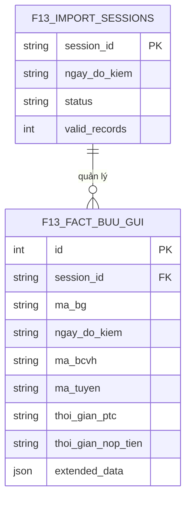

# DATABASE DESIGN SPECIFICATION v1.0 (F1.3)

## 1. Executive Summary
Tài liệu cung cấp kiến trúc cơ sở dữ liệu (Database Architecture) cho module F1.3. Thiết kế tuân thủ nghiêm ngặt SSOT hiện hành, hỗ trợ hoàn hảo API Contract (A3) và giao diện Dashboard (A2). Kiến trúc kết hợp Fact Table cho dữ liệu chi tiết và Import Log để quản trị tính toàn vẹn (Preview/Confirm/Overwrite). Không đưa Business Logic vào DB, DB chỉ đảm bảo Storage, Constraint và Performance.

---

## 2. Table Catalog (Danh sách Entity)
1. **`f13_import_sessions`**: Quản lý lịch sử nạp dữ liệu, trạng thái Preview/Confirm.
2. **`f13_fact_buu_gui`**: Bảng Fact lưu trữ dữ liệu chi tiết toàn vẹn của bưu gửi, làm nền tảng cho RCA, Drill-down và Evidence List.
3. **`f13_dim_bcvh`** (View/Table): Dimension Bưu cục vận hành, phục vụ Ranking.
4. **`f13_dim_route`** (View/Table): Dimension Tuyến phát, phục vụ Ranking.

---

## 3. Table & Column Design

### 3.1 Table: `f13_import_sessions`
- **Purpose**: Lưu trữ log tải lên, hỗ trợ luồng API Preview và Confirm. Đảm bảo tính toàn vẹn và cho phép truy vết dữ liệu (Audit Trail).
- **Primary Key**: `session_id` (TEXT/UUID).
- **Columns**:
  - `session_id` (TEXT, NOT NULL)
  - `ngay_do_kiem` (TEXT, NOT NULL): Lưu chuẩn ISO8601 YYYY-MM-DD.
  - `file_name` (TEXT, NOT NULL)
  - `status` (TEXT, NOT NULL): `PREVIEW`, `CONFIRMED`, `FAILED`.
  - `total_records` (INTEGER, DEFAULT 0)
  - `valid_records` (INTEGER, DEFAULT 0)
  - `error_records` (INTEGER, DEFAULT 0)
  - `created_at` (TEXT, DEFAULT CURRENT_TIMESTAMP)
- **Index**: Index trên `ngay_do_kiem` và `status`.

### 3.2 Table: `f13_fact_buu_gui`
- **Purpose**: Bảng trung tâm (Fact) lưu trữ **TOÀN BỘ 41 CỘT** từ file Excel gốc để chống mất mát dữ liệu và bảo đảm khả năng mở rộng RCA trong tương lai (Không chỉ 8 cột). 
- **Primary Key**: `id` (INTEGER AUTOINCREMENT - Surrogate Key). (Việc dùng Natural Key `ma_bg + ngay_do_kiem` mang rủi ro Crash Import khi có dữ liệu đúp bất thường. Thay vào đó dùng Surrogate Key kết hợp Index Unique sẽ an toàn hơn cho luồng Rollback).
- **Columns** (Trích xuất các cột chính, các cột còn lại map 1-1 với SSOT):
  - `id` (INTEGER, PRIMARY KEY AUTOINCREMENT)
  - `session_id` (TEXT, NOT NULL): Trỏ về phiên Import.
  - `ngay_do_kiem` (TEXT, NOT NULL): Dạng ISO8601 (YYYY-MM-DD).
  - `ma_bg` (TEXT, NOT NULL)
  - `ma_bcvh` / `ten_bcvh` (TEXT)
  - `ma_tuyen` / `ten_tuyen` (TEXT)
  - `ket_qua_f13` (TEXT)
  - `thoi_gian_ptc` (TEXT, NULL): ISO8601 (YYYY-MM-DD HH:MM:SS)
  - `thoi_gian_nop_tien` (TEXT, NULL): ISO8601 (YYYY-MM-DD HH:MM:SS)
  - `extended_data` (JSON, NULL): 
    - **Quy tắc tuyệt đối**: `extended_data` chỉ dùng lưu dữ liệu gốc (Raw Archive).
    - Không được dùng cho Dashboard.
    - Không được dùng cho API Query.
    - Không được dùng cho Rule Engine.
    - Không được dùng cho KPI Calculation.

- **Constraint Definition**:
  - **PRIMARY KEY**: `id`
  - **FOREIGN KEY**: `session_id` tham chiếu `f13_import_sessions(session_id)`.
  - **UNIQUE**: `UNIQUE(ma_bg, ngay_do_kiem)`.
    - *Lý do*: Lựa chọn `(ma_bg, ngay_do_kiem)` thay vì `(ma_bg, ngay_do_kiem, session_id)` vì một bưu gửi chỉ được phép xuất hiện duy nhất 1 lần trong 1 ngày, bất kể thuộc Session nào. Nếu đưa `session_id` vào UNIQUE, hệ thống sẽ sinh ra rủi ro 1 BG bị đúp trên 2 Session khác nhau trong cùng 1 ngày, phá vỡ tính đúng đắn của Dashboard.

---

## 4. Relationship & ERD



---

## 5. Constraint & Data Integrity
1. **UNIQUE(`ma_bg`, `ngay_do_kiem`)**: Chặn Insert đúp trong cùng 1 ngày kiểm tra.
2. **CHECK Constraints**: 
   - `thoi_gian_nop_tien >= thoi_gian_ptc` (Bảo vệ dữ liệu tương lai/logic ngược). 
3. **Data Integrity (Import API)**:
   - **Preview**: Ghi tạm vào `f13_import_sessions` với status `PREVIEW`, KHÔNG ghi vào `fact`.
   - **Confirm (Overwrite Transaction)**: Bắt buộc thực hiện theo luồng Transaction nghiêm ngặt để tránh mất dữ liệu khi lỗi giữa chừng:
     ```sql
     BEGIN TRANSACTION;
     DELETE FROM f13_fact_buu_gui WHERE ngay_do_kiem = ?;
     INSERT INTO f13_fact_buu_gui (...) VALUES (...);
     -- Cập nhật status thành CONFIRMED
     COMMIT;
     -- Nếu có bất kỳ lỗi nào xảy ra:
     ROLLBACK;
     ```

---

## 6. Performance (Indexing Strategy)
- **Index 1**: `idx_ngay_do_kiem` trên `(ngay_do_kiem, ket_qua_f13)`. 
- **Index 2**: `idx_bcvh_ngay` trên `(ngay_do_kiem, ma_bcvh, ket_qua_f13)`.
- **Index 3**: `idx_tuyen_ngay` trên `(ngay_do_kiem, ma_bcvh, ma_tuyen, ket_qua_f13)`.
- **Index 4**: `idx_session` trên `(session_id)` để tối ưu hóa tốc độ khi thực hiện Rollback/Xóa theo phiên Import.

---

## 7. Future Compatibility
- **Dashboard Mới**: Bảng Fact bảo toàn dữ liệu qua JSON `extended_data` hoặc dàn phẳng 41 cột. Không mất mát thông tin.
- **RCA Mới**: Nếu trong tương lai cần phân tích thêm nguyên nhân mới (Ca phát, Loại DV), chỉ việc parse từ JSON mà không cần DDL (Alter table).
