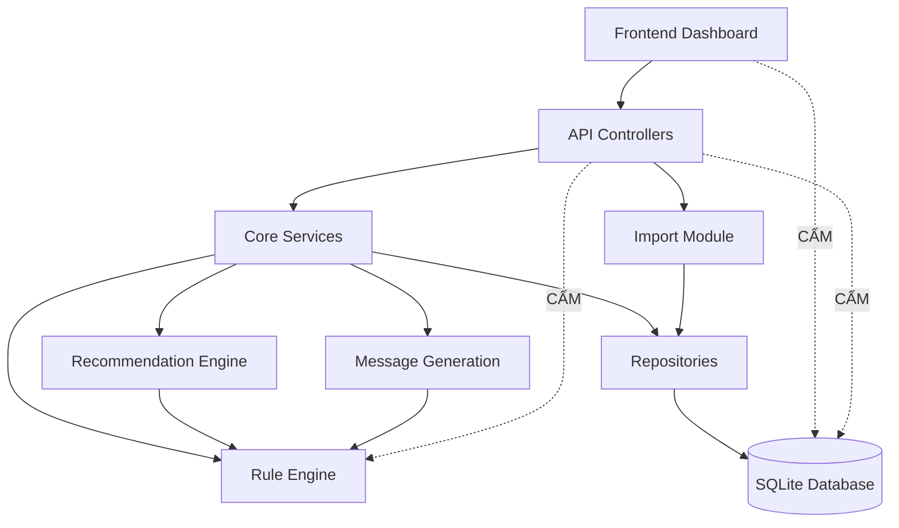
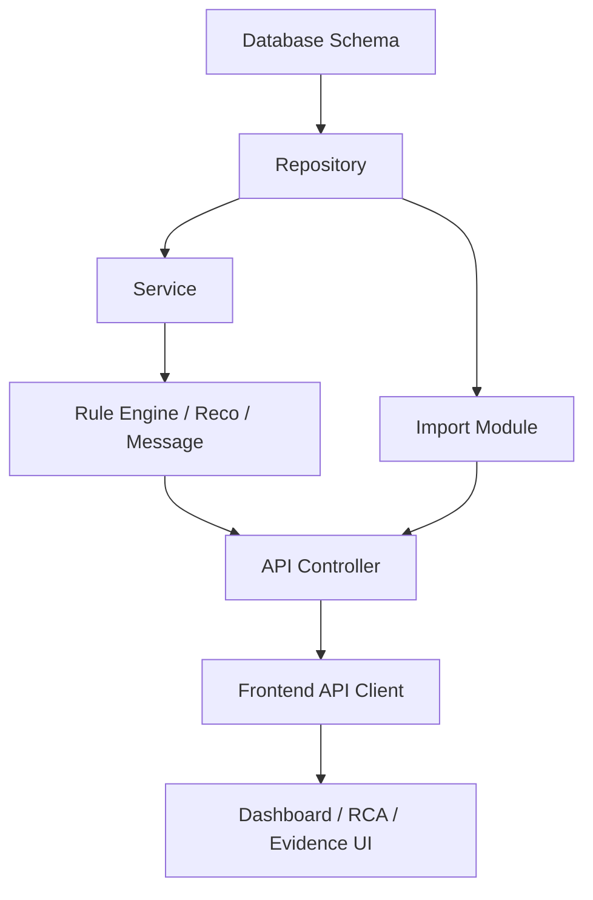

# DEVELOPMENT ARCHITECTURE BLUEPRINT v1.0 (F1.3)

## 1. Source Tree (Cấu trúc thư mục)
Kiến trúc thư mục được phân tách rõ ràng (Separation of Concerns) để Backend và Frontend phát triển độc lập.

```text
TTVH-DHCL/
├── backend/
│   ├── src/
│   │   ├── api/                 # Controllers & Routes (Xử lý HTTP, Validate Request)
│   │   ├── services/            # Core Business Flow (Xử lý luồng nghiệp vụ)
│   │   ├── repositories/        # Data Access Layer (Giao tiếp SQLite)
│   │   ├── engine/
│   │   │   ├── rules/           # Rule Engine (Đánh giá ngưỡng KPI F13_303 > 3h)
│   │   │   ├── recommendations/ # Recommendation Engine (Sinh Auto-Insight)
│   │   │   └── messages/        # Message Generation (Template tin nhắn)
│   │   ├── import/              # Upload, Excel Parser, Preview/Confirm Logic
│   │   └── config/              # Constants, DB Connection
│   └── tests/                   # Unit & Integration Tests
└── frontend/
    ├── src/
    │   ├── api/                 # API Client (Axios calls map 1-1 với Backend API)
    │   ├── pages/               # Dashboard, BCVH Ranking, RCA, Evidence List
    │   ├── components/          # Widgets, Pareto Chart, DataTable
    │   └── store/               # State Management
```

---

## 2. Coding Order (Trình tự lập trình)
Để tránh Blocker giữa 2 team, tiến trình code tuân thủ theo luồng Bottom-Up (từ lõi ra vỏ):

1. **Database Schema** (Khởi tạo SQLite DDL).
2. **Repository Layer** (Các hàm CRUD cơ bản).
3. **Core Services & Rule Engine** (Code logic nghiệp vụ nền tảng).
4. **API Controllers** (Đóng gói Service thành REST API, chốt Contract).
   *(Đến đây Frontend có thể gọi API thực tế hoặc Mock).*
5. **Import Module** (Xây dựng luồng Preview/Confirm để có dữ liệu thực).
6. **Frontend API Client & Store** (Gắn kết Frontend với Backend).
7. **Frontend Components** (Code UI, Vẽ Chart).
8. **Dashboard Assembly** (Lắp ráp UI thành luồng hoàn chỉnh).
9. **End-to-End Testing**.

---

## 3. Dependency Graph
Kiến trúc quy định rõ luồng phụ thuộc một chiều (Unidirectional Dependency).


**Quy tắc vi phạm (Forbidden Dependency):**
- Frontend **Tuyệt đối không** gọi trực tiếp DB (Chống SQL Injection).
- API **Tuyệt đối không** gọi thẳng Repository hoặc DB (Bypass Service).
- API **Tuyệt đối không** nhúng tay vào Rule Engine.

---

## 4. Layer Boundary (Khóa Kiến trúc)

| Layer | Input | Output | Responsibility (Trách nhiệm) | Forbidden (Cấm) |
| :--- | :--- | :--- | :--- | :--- |
| **Database** | SQL Query | Raw Data | Lưu trữ, bảo vệ toàn vẹn Constraints. | Chứa Business Logic (SP/Trigger phức tạp). |
| **Repository** | ID, Query Params | Model Object | Giao tiếp SQLite, chạy Index. | Tính toán KPI F13_303. |
| **Service** | DTO | Business Model | Điều phối luồng, kết nối Engine & Repo. | Nhận HTTP Request/Response. |
| **Rule Engine** | Fact (Data) | Alert / Result | Tính toán ngưỡng (> 3h), sinh KPI. | Truy vấn Database trực tiếp. |
| **Message Gen** | Alert / Rule | Text Template | Render nội dung tin nhắn. | Thay đổi trạng thái bưu gửi. |
| **API** | HTTP Request | JSON Envelope | Validate tham số, Authentication. | Viết `if/else` logic nghiệp vụ. |
| **Frontend** | User Click | API Call / UI | Hiển thị Chart, Xử lý giao diện. | Tự Filter/Sort Data cục bộ thay cho Backend. |

---

## 5. Development Milestone (Sprints)

### Sprint 1: Foundation & Data Import
- **Goal**: Dựng móng hệ thống và luồng nạp dữ liệu.
- **Deliverables**: DB Schema, Repository, Import API (Preview/Confirm).
- **Exit Criteria**: 
  - Import chạy thành công, đọc trơn tru file Excel mẫu.
  - Database ghi thành công bản ghi vào `f13_fact_buu_gui`.
  - Rollback hoạt động hoàn hảo khi bị lỗi (không để lại rác).

### Sprint 2: Core Engine & API Providers
- **Goal**: Xây dựng toàn bộ lõi tính toán và bộc lộ API.
- **Deliverables**: Rule Engine, Recommendation Engine, API Endpoints (KPI, Ranking, RCA, Evidence).
- **Exit Criteria**: 
  - API trả về JSON đúng Contract Phase A3 (100% khớp).
  - Unit Test PASS cho toàn bộ logic ngưỡng `> 3h`.

### Sprint 3: Dashboard & Ranking (Frontend)
- **Goal**: Lắp ráp UI khối Tổng quan và Xếp hạng.
- **Deliverables**: Executive Dashboard (KPI Cards, Chart), BCVH Ranking, Route Ranking.
- **Exit Criteria**: 
  - UI hiển thị đúng số liệu lấy từ API.
  - Thao tác filter theo ngày hoạt động chính xác.

### Sprint 4: RCA & Drill-down Integration
- **Goal**: Thông luồng trải nghiệm RCA cuối cùng.
- **Deliverables**: Pareto Chart, Impact Analysis, Evidence List, Khung hiển thị Message.
- **Exit Criteria**: 
  - Trải nghiệm Drill-down mượt mà từ `Dashboard → BCVH → Tuyến → BG`.
  - Không có lỗi vỡ Layout. Tốc độ query < 1s.

---

## 6. Module Inventory
| Module | Responsibility | Input | Output | Dependency | Related SSOT | Related API | Related DB |
| --- | --- | --- | --- | --- | --- | --- | --- |
| **Import** | Đọc, parse, validate Excel | Excel file | JSON / Insert DB | Repository | Research Baseline | `/api/v1/f13/import/*` | `f13_import_sessions`, `f13_fact_buu_gui` |
| **Repository** | Giao tiếp SQLite, Query Data | Params | Model List | Database | Data Blueprint | N/A | Toàn bộ bảng |
| **Service** | Điều phối Business Flow | API DTO | Core Models | Repository, Engine | N/A | Tất cả API | N/A |
| **Rule Engine** | Đánh giá KPI, Ngưỡng >3h | Fact Model | Result/Alert | None | F13_303 Definition | `/dashboard/kpi` | N/A |
| **Reco Engine** | Sinh Auto-Insight | KPI Results | Insights List | Rule Engine | Dashboard Design | `/recommendations` | N/A |
| **Message Engine** | Sinh Text Template | Rule Result | Message Text | Rule Engine | F13_303 Definition | `/messages` | N/A |
| **API Controller** | Nhận HTTP, Gọi Service | Request | JSON Envelope | Service | API Contract | Toàn bộ API | N/A |
| **API Client (FE)** | Gọi Axios, Fetch Data | Params | JS Promise | Backend API | API Contract | N/A | N/A |
| **Dashboard (FE)** | Hiển thị KPI, Chart | JSON Data | UI Elements | API Client | Dashboard Design | `/dashboard/kpi` | N/A |
| **RCA (FE)** | Vẽ Pareto, Impact Table | JSON Data | UI Panels | API Client | Dashboard Design | `/rca/pareto` | N/A |
| **Evidence List** | Hiển thị DS bưu gửi lỗi | JSON Data | DataGrid | API Client | Dashboard Design | `/evidence-list` | N/A |

---

## 7. Coding Dependency Matrix
Trình tự phụ thuộc khi lập trình (Quy định đường găng tiến độ). Tuyệt đối không được phép có Dependency ngược (Ví dụ: Không code API khi chưa có Service).



---

## 8. Definition of Done (DoD)
Tiêu chuẩn chung để nghiệm thu hoàn thành một Module/Tính năng:
1. **Coding**: Viết code sạch, không có linter warnings, tuân thủ chặt chẽ nghiệp vụ SSOT.
2. **Unit Test**: Khối Rule Engine và Core Service phải có Unit Test.
3. **Integration Test**: Luồng Import và REST API chạy thành công và trả về JSON chuẩn xác.
4. **Review**: Trải qua Technical Audit.
5. **Commit**: Code được commit rõ nghĩa theo luồng tính năng.
6. **Push**: Đẩy lên repository đúng branch.
7. **Audit**: Pass khâu nghiệm thu (A5+) trước khi hợp nhất hệ thống.

---

## 9. Technical Risks
| Risk | Cause | Impact | Mitigation |
| :--- | :--- | :--- | :--- |
| **Out of Memory khi Import** | File Excel quá lớn (>100k dòng), parse toàn bộ vào RAM bằng thư viện cũ. | Sập Node.js process (OOM). | Chạy Stream hoặc chia nhỏ mảng để map Insert vào DB theo chunk. |
| **Chậm Drill-down RCA** | Thiếu Composite Index khi query `ma_tuyen`. | API timeout (>3s), UI treo. | Bắt buộc khởi tạo đầy đủ Index đã khai báo ở Phase A4. |
| **Mất đồng bộ FE/BE** | Backend trả sai tên trường JSON (Snake_case vs CamelCase). | UI vỡ, hiển thị `undefined`. | Kiểm soát 100% bằng API_DESIGN_v1.0. Không tự ý đổi tên field. |
| **Lỗi Lock Database** | SQLite bị block khi đọc/ghi đồng thời luồng lớn. | Sinh mã `SQLITE_BUSY`. | Sử dụng WAL mode cho SQLite, thiết lập `busy_timeout`. |
