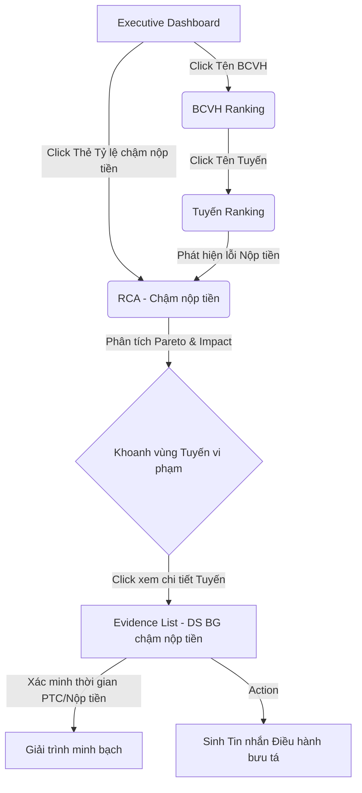

# DASHBOARD DESIGN SPECIFICATION v1.0 (F1.3)

## 1. Executive Dashboard (Màn hình Tổng Quan)
- **Mục tiêu**: Cung cấp bức tranh toàn cảnh về sức khỏe chất lượng phát liên tỉnh (F1.3), giúp Lãnh đạo TTVH nhận diện rủi ro hệ thống tức thì.
- **Người sử dụng**: Giám đốc TTVH, Lãnh đạo cấp cao, Điều hành viên trưởng.
- **Layout**: 
  - **Header**: Bộ lọc thời gian (Mặc định N-1).
  - **Top Row (KPI Cards)**: Các thẻ số liệu trọng yếu.
  - **Middle Row**: Biểu đồ Xu hướng (Quality Timeline) & Khung Auto-Insight / Message Generation.
  - **Bottom Row**: Bảng Top 5 BCVH Tốt nhất / Kém nhất.
- **KPI Cards**: Tổng bưu gửi, Tỷ lệ Đạt (%), Tỷ lệ Không đạt (%), **Tỷ lệ chậm nộp tiền (F13_303)**.
- **Recommendation & Message Generation**: Khung thông báo nằm vị trí trung tâm, tự động trigger kịch bản khi F13_303 vượt ngưỡng. Hệ thống hiển thị rõ dòng giải thích: *"Dựa trên nguyên tắc Thời gian nộp tiền sau PTC > 3 giờ"*.
- **Click Action**: Click vào thẻ *Tỷ lệ chậm nộp tiền* sẽ Drill-down thẳng sang màn hình RCA (Tab Chậm nộp tiền).

## 2. BCVH Ranking (Bảng xếp hạng BCVH)
- **Mục tiêu**: Đánh giá và xếp hạng thành tích của các Bưu cục vận hành.
- **Người sử dụng**: Điều hành viên, Tổ trưởng Bưu cục.
- **Layout**: Bảng dữ liệu đa chiều (Data Grid) tích hợp thanh công cụ tìm kiếm và xuất báo cáo.
- **Các cột (Columns)**: 
  - Tên BCVH
  - Tổng BG
  - Tỷ lệ Đạt
  - Tổng BG Không đạt
  - **Tỷ lệ chậm nộp tiền (F13_303)**
- **Business Meaning**: Cột F13_303 ở màn hình này giúp Điều hành viên sắp xếp (Sort) để dễ dàng bóc tách những Bưu cục rớt KPI chủ yếu do lỗi nộp tiền muộn.
- **Click Action**: Click vào Tên BCVH sẽ Drill-down xuống danh sách các Tuyến phát thuộc Bưu cục đó.

## 3. RCA - Chậm nộp tiền (Phân tích nguyên nhân)
- **Mục tiêu**: Mổ xẻ chuyên sâu, khoanh vùng chính xác điểm nghẽn nghiệp vụ làm phát sinh lỗi chậm nộp tiền.
- **Người sử dụng**: Điều hành viên chuyên trách.
- **Layout**: Không gian phân tích đa chiều. **NGHIÊM CẤM** hiển thị bộ lọc So sánh cùng kỳ (SWC) tại màn hình này.

### Pareto Specification
- **Input**: TODO (SSOT chưa quy định chi tiết nguồn dữ liệu)
- **Output**: TODO (SSOT chưa quy định)
- **Formula**: TODO (SSOT chưa quy định)
- **Business Meaning**: Trực quan hóa định lý 80/20, giúp Điều hành viên xác định ngay 20% tuyến phát gây ra 80% lỗi toàn mạng.
- **Drill-down**: TODO (SSOT chưa quy định chi tiết thao tác)
- **Điều kiện áp dụng**: TODO (SSOT chưa quy định)

- **Impact Analysis Table**:
  - *Cột 1*: Tên Tuyến/Bưu tá
  - *Cột 2*: Tổng BG Không đạt
  - *Cột 3*: BG chậm nộp tiền (>3h)
  - *Cột 4*: Tỷ lệ đóng góp vào nhóm Không đạt (%)
- **Click Action**: Click vào tên Tuyến trong bảng Impact sẽ kích hoạt màn hình Evidence List.

## 4. Evidence List (Danh sách chứng cứ - BG chậm nộp tiền)
- **Mục tiêu**: Điểm chạm cuối cùng, cung cấp danh sách minh bạch đến cấp bưu gửi để truy vết, giải trình, và sinh tin nhắn nhắc nhở. Giải quyết triệt để "Explainability Gap".
- **Người sử dụng**: Điều hành viên, Bưu tá.
- **Layout**: Bảng dữ liệu phẳng, hiển thị rành mạch nguyên tắc vi phạm.
- **Các cột (Columns)**:
  - *Số hiệu bưu gửi (ma_bg)*: Mã định danh để tra cứu.
  - *BCVH*: Missing Candidate Field (Need PO Decision)
  - *Tuyến phát*: Missing Candidate Field (Need PO Decision)
  - *Bưu tá*: Missing Candidate Field (Need PO Decision)
  - *Thời gian PTC*: Mốc thời gian phát thành công.
  - *Thời gian nộp tiền*: Mốc thời gian chốt tiền trên hệ thống.
  - *Thời gian chậm*: Missing Candidate Field (Need PO Decision)
  - *Trạng thái xử lý*: Missing Candidate Field (Need PO Decision)

### Action Specification
- **Người được phép gửi**: TODO (SSOT chưa quy định)
- **Đối tượng nhận**: TODO (SSOT chưa quy định)
- **Điều kiện được gửi**: TODO (SSOT chưa quy định)
- **Luồng Preview trước khi gửi**: TODO (SSOT chưa quy định)
- **Có cho phép chỉnh sửa nội dung hay không**: TODO (SSOT chưa quy định)
- **Có lưu lịch sử gửi hay không**: TODO (SSOT chưa quy định)
- **Quan hệ với Message Generation**: TODO (SSOT chưa quy định)

## 5. Dashboard Navigation Map (Luồng trải nghiệm)

Hệ thống được thiết kế theo tư duy: **Tổng quan → Phân tích → Chứng cứ → Hành động**.

**Navigation Gap**: Theo rà soát SSOT hiện hành, luồng trải nghiệm đang bị đứt quãng. Hoàn toàn thiếu bước: `BG → Action → Message → Follow-up`. (Chưa đưa vào sơ đồ để tránh tự tạo quy trình ngoài SSOT).

---

## 6. Recommendation Boundary (Khóa kiến trúc)
Nguyên tắc bất di bất dịch của phân lớp hiển thị:
- Dashboard **chỉ HIỂN THỊ** Recommendation.
- Dashboard **KHÔNG sinh** Recommendation.
- Recommendation **chỉ đến từ** Recommendation Engine.
- Auto Insight **chỉ là lớp hiển thị** (Presentation Layer), không chứa logic nghiệp vụ cốt lõi.
