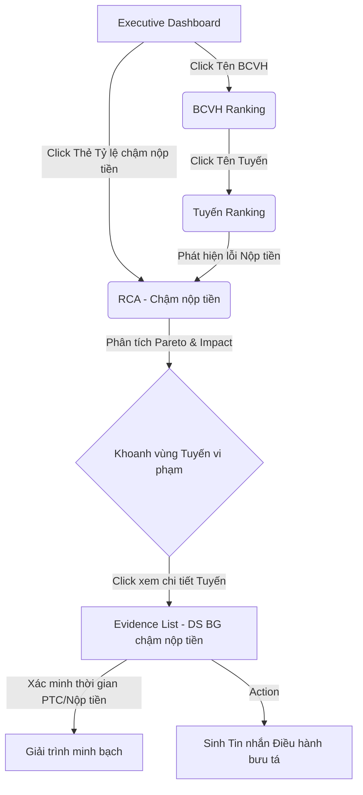

# DASHBOARD DESIGN SPECIFICATION v1.0 (F1.3)

## 1. Executive Dashboard (Màn hình Tổng Quan)
- **Mục tiêu**: Cung cấp bức tranh toàn cảnh về sức khỏe chất lượng phát liên tỉnh (F1.3), giúp Lãnh đạo TTVH nhận diện rủi ro hệ thống tức thì.
- **Người sử dụng**: Giám đốc TTVH, Lãnh đạo cấp cao, Điều hành viên trưởng.
- **Layout**: 
  - **Header**: Bộ lọc thời gian (Mặc định N-1).
  - **Top Row (KPI Cards)**: Các thẻ số liệu trọng yếu.
  - **Middle Row**: Biểu đồ Xu hướng (Quality Timeline) & Khung Auto-Insight / Message Generation.
  - **Bottom Row**: Bảng Top 5 BCVH Tốt nhất / Kém nhất.
- **KPI Cards**: Tổng bưu gửi, Tỷ lệ Đạt (%), Tỷ lệ Không đạt (%), **Tỷ lệ chậm nộp tiền (F13_303)**.
- **Recommendation & Message Generation**: Khung thông báo nằm vị trí trung tâm, tự động trigger kịch bản khi F13_303 vượt ngưỡng. Hệ thống hiển thị rõ dòng giải thích: *"Dựa trên nguyên tắc Thời gian nộp tiền sau PTC > 3 giờ"*.
- **Click Action**: Click vào thẻ *Tỷ lệ chậm nộp tiền* sẽ Drill-down thẳng sang màn hình RCA (Tab Chậm nộp tiền).

## 2. BCVH Ranking (Bảng xếp hạng BCVH)
- **Mục tiêu**: Đánh giá và xếp hạng thành tích của các Bưu cục vận hành.
- **Người sử dụng**: Điều hành viên, Tổ trưởng Bưu cục.
- **Layout**: Bảng dữ liệu đa chiều (Data Grid) tích hợp thanh công cụ tìm kiếm và xuất báo cáo.
- **Các cột (Columns)**: 
  - Tên BCVH
  - Tổng BG
  - Tỷ lệ Đạt
  - Tổng BG Không đạt
  - **Tỷ lệ chậm nộp tiền (F13_303)**
- **Business Meaning**: Cột F13_303 ở màn hình này giúp Điều hành viên sắp xếp (Sort) để dễ dàng bóc tách những Bưu cục rớt KPI chủ yếu do lỗi nộp tiền muộn.
- **Click Action**: Click vào Tên BCVH sẽ Drill-down xuống danh sách các Tuyến phát thuộc Bưu cục đó.

## 3. RCA - Chậm nộp tiền (Phân tích nguyên nhân)
- **Mục tiêu**: Mổ xẻ chuyên sâu, khoanh vùng chính xác điểm nghẽn nghiệp vụ làm phát sinh lỗi chậm nộp tiền.
- **Người sử dụng**: Điều hành viên chuyên trách.
- **Layout**: Không gian phân tích đa chiều. **NGHIÊM CẤM** hiển thị bộ lọc So sánh cùng kỳ (SWC) tại màn hình này.
- **Chart (Pareto)**: 
  - *Trục X*: Tên Tuyến / BCVH.
  - *Trục Y1 (Bar)*: Số lượng BG chậm nộp tiền (F13_302).
  - *Trục Y2 (Line)*: Tỷ lệ tích lũy (%). 
  - *Vai trò*: Trực quan hóa định lý 80/20, giúp Điều hành viên xác định ngay 20% tuyến phát gây ra 80% lỗi toàn mạng.
- **Impact Analysis Table**:
  - *Cột 1*: Tên Tuyến/Bưu tá
  - *Cột 2*: Tổng BG Không đạt
  - *Cột 3*: BG chậm nộp tiền (>3h)
  - *Cột 4*: Tỷ lệ đóng góp vào nhóm Không đạt (%)
- **Click Action**: Click vào tên Tuyến trong bảng Impact sẽ kích hoạt màn hình Evidence List.

## 4. Evidence List (Danh sách chứng cứ - BG chậm nộp tiền)
- **Mục tiêu**: Điểm chạm cuối cùng, cung cấp danh sách minh bạch đến cấp bưu gửi để truy vết, giải trình, và sinh tin nhắn nhắc nhở. Giải quyết triệt để "Explainability Gap".
- **Người sử dụng**: Điều hành viên, Bưu tá.
- **Layout**: Bảng dữ liệu phẳng, hiển thị rành mạch nguyên tắc vi phạm.
- **Các cột (Columns)**:
  - *Số hiệu bưu gửi (ma_bg)*: Mã định danh để tra cứu.
  - *Thời gian PTC*: Mốc thời gian phát thành công.
  - *Thời gian nộp tiền*: Mốc thời gian chốt tiền trên hệ thống.
  - *Độ trễ (h)*: Tính toán thực tế (Ví dụ: 3.5 giờ - Hiển thị chữ Đỏ).
- **Action**: Checkbox chọn các bưu gửi vi phạm, bấm nút "Gửi Tin Điều Hành" để sinh Message bắn trực tiếp xuống thiết bị của bưu tá.
- **Click Action**: Click vào Số hiệu bưu gửi sẽ link thẳng đến hệ thống Core (TMS/BCCP) để xem hành trình gốc.

---

## 5. Dashboard Navigation Map (Luồng trải nghiệm)

Hệ thống được thiết kế theo tư duy: **Tổng quan → Phân tích → Chứng cứ → Hành động**.

### Kịch bản Điều hành viên sử dụng thực tế:
1. Đăng nhập hệ thống, quan sát **Executive Dashboard**, chú ý khối **Auto-Insight** báo đỏ: *"Tỷ lệ chậm nộp tiền toàn mạng tăng cao, vượt ngưỡng 10%"*.
2. Click thẳng vào cảnh báo để chuyển sang màn hình **RCA - Chậm nộp tiền**.
3. Tại đây, biểu đồ **Pareto** chỉ rõ Bưu cục A và Tuyến B đang chiếm 80% số bưu gửi vi phạm.
4. Điều hành viên click vào Tuyến B trong bảng **Impact Analysis**, hệ thống mở ra **Evidence List**.
5. Trong bảng chứng cứ, Điều hành viên nhìn thấy rõ các mã bưu gửi, thời gian PTC là 08:00 nhưng thời gian nộp tiền là 14:00 (Trễ 6 tiếng, vi phạm chuẩn >3 tiếng).
6. Điều hành viên chọn toàn bộ danh sách, bấm *"Gửi tin nhắn"*, hệ thống lập tức xuất ra mẫu **Message Generation** theo chuẩn SSOT để gửi bưu tá.
