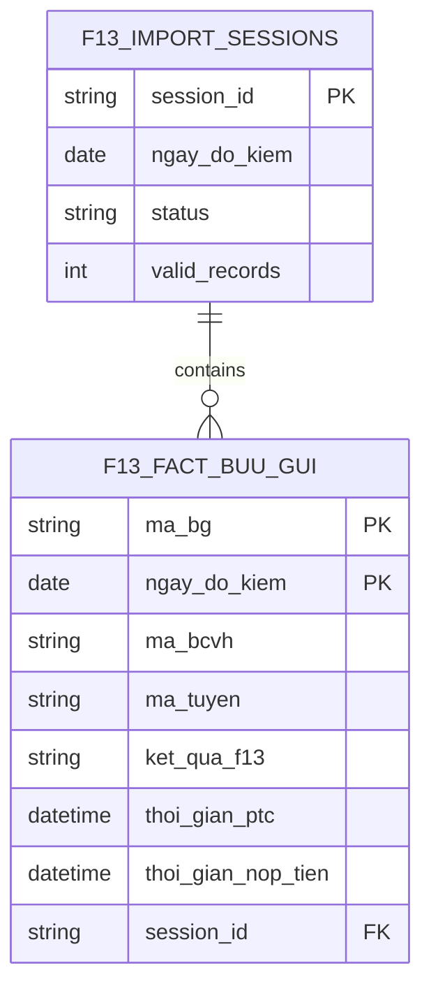

# DATABASE DESIGN SPECIFICATION v1.0 (F1.3)

## 1. Executive Summary
Tài liệu cung cấp kiến trúc cơ sở dữ liệu (Database Architecture) cho module F1.3. Thiết kế tuân thủ nghiêm ngặt SSOT hiện hành, hỗ trợ hoàn hảo API Contract (A3) và giao diện Dashboard (A2). Kiến trúc kết hợp Fact Table cho dữ liệu chi tiết và Import Log để quản trị tính toàn vẹn (Preview/Confirm/Overwrite). Không đưa Business Logic vào DB, DB chỉ đảm bảo Storage, Constraint và Performance.

---

## 2. Table Catalog (Danh sách Entity)
1. **`f13_import_sessions`**: Quản lý lịch sử nạp dữ liệu, trạng thái Preview/Confirm.
2. **`f13_fact_buu_gui`**: Bảng Fact lưu trữ dữ liệu chi tiết từng bưu gửi, làm nền tảng cho RCA, Drill-down và Evidence List.
3. **`f13_dim_bcvh`** (View/Table): Dimension Bưu cục vận hành, phục vụ Ranking.
4. **`f13_dim_route`** (View/Table): Dimension Tuyến phát, phục vụ Ranking.

---

## 3. Table & Column Design

### 3.1 Table: `f13_import_sessions`
- **Purpose**: Lưu trữ log tải lên, hỗ trợ luồng API Preview và Confirm. Đảm bảo tính toàn vẹn và cho phép truy vết dữ liệu (Audit Trail).
- **Primary Key**: `session_id` (UUID).
- **Columns**:
  - `session_id` (VARCHAR/UUID, NOT NULL): ID duy nhất của phiên import.
  - `ngay_do_kiem` (DATE, NOT NULL): Ngày dữ liệu (rút trích từ tên file).
  - `file_name` (VARCHAR, NOT NULL): Tên file Excel gốc.
  - `status` (VARCHAR, NOT NULL): Trạng thái (`PREVIEW`, `CONFIRMED`, `FAILED`).
  - `total_records` (INT, DEFAULT 0): Tổng số dòng đọc được.
  - `valid_records` (INT, DEFAULT 0): Số dòng hợp lệ.
  - `error_records` (INT, DEFAULT 0): Số dòng lỗi.
  - `created_at` (DATETIME, DEFAULT CURRENT_TIMESTAMP).
- **Index**: Index trên `ngay_do_kiem` và `status`.

### 3.2 Table: `f13_fact_buu_gui`
- **Purpose**: Bảng trung tâm (Fact) chứa chi tiết toàn bộ bưu gửi F1.3. Phục vụ tính KPI, vẽ Pareto, và Evidence List.
- **Primary Key**: Kép `(ma_bg, ngay_do_kiem)`.
- **Columns**:
  - `ma_bg` (VARCHAR, NOT NULL): Số hiệu bưu gửi (Business Key).
  - `ngay_do_kiem` (DATE, NOT NULL): Phục vụ Partition/Filter theo ngày.
  - `ma_bcvh` (VARCHAR, NOT NULL): Mã Bưu cục vận hành.
  - `ten_bcvh` (VARCHAR, NULL): Tên BCVH.
  - `ma_tuyen` (VARCHAR, NOT NULL): Mã tuyến phát.
  - `ten_tuyen` (VARCHAR, NULL): Tên tuyến phát.
  - `ket_qua_f13` (VARCHAR, NOT NULL): 'Đạt' / 'Không đạt'.
  - `thoi_gian_ptc` (DATETIME, NULL): Mốc phát thành công.
  - `thoi_gian_nop_tien` (DATETIME, NULL): Mốc nộp tiền.
  - `session_id` (VARCHAR, NOT NULL): FK trỏ về bảng log, dùng để cascade delete khi Overwrite.
- **Foreign Key**: `session_id` tham chiếu `f13_import_sessions(session_id)`.
- **Unique Constraint**: `UNIQUE(ma_bg, ngay_do_kiem)`. Chống insert đúp.

---

## 4. Relationship & ERD

Hệ thống được thiết kế theo mô hình Star Schema phẳng (Do đặc thù SQLite) kết hợp hệ thống Audit.

- **1-N**: Một `session_id` (Confirmed) sẽ sở hữu nhiều dòng `f13_fact_buu_gui`. Khi import overwrite, hệ thống xóa theo `session_id` cũ và thêm `session_id` mới.

---

## 5. Constraint & Data Integrity
Database được cấu hình cứng để hỗ trợ API Contract:
1. **UNIQUE(`ma_bg`, `ngay_do_kiem`)**: Không bao giờ tồn tại 2 bản ghi của 1 bưu gửi trong cùng 1 ngày kiểm tra.
2. **CHECK Constraints**: 
   - Không cho phép Insert nếu `thoi_gian_nop_tien` < `thoi_gian_ptc` (Bảo vệ dữ liệu tương lai/logic ngược).
3. **Data Integrity (Import API)**:
   - **Preview**: API chỉ ghi tạm vào RAM/Redis hoặc trả về JSON, không INSERT vào `f13_fact_buu_gui`.
   - **Confirm**: Khởi tạo Transaction (BEGIN). Nếu `force_overwrite = true`, `DELETE FROM f13_fact_buu_gui WHERE ngay_do_kiem = ?`, sau đó `INSERT`. Nếu lỗi, Rollback toàn bộ.
4. **NULL Handling**: `thoi_gian_ptc` và `thoi_gian_nop_tien` cho phép `NULL` (vì có BG chưa phát/chưa nộp), nhưng logic truy vấn RCA sẽ bỏ qua các dòng `NULL`.

---

## 6. Performance (Indexing Strategy)
Để hỗ trợ Dashboard (tốc độ < 1s) và RCA Drill-down:
- **Index 1 (Filter Index)**: `idx_ngay_do_kiem` trên `(ngay_do_kiem, ket_qua_f13)`. (Phục vụ truy vấn đếm KPI tổng).
- **Index 2 (Drill-down BCVH)**: `idx_bcvh_ngay` trên `(ngay_do_kiem, ma_bcvh, ket_qua_f13)`.
- **Index 3 (Drill-down Tuyến)**: `idx_tuyen_ngay` trên `(ngay_do_kiem, ma_bcvh, ma_tuyen, ket_qua_f13)`.
- **Index 4 (Evidence List)**: Tận dụng Index PK `(ma_bg)` kết hợp Index Tuyến.
*(Các chỉ số Thời gian trễ > 3h được tính toán On-the-fly bởi Backend kết hợp SQL Date/Time functions, không cần Index do tập mẫu "Không Đạt" nhỏ).*

---

## 7. Future Compatibility
Kiến trúc cực kỳ linh hoạt:
- **Dashboard Mới**: Fact Table ở dạng Raw Data. Mọi Chart mới, KPI mới có thể tạo ra bằng cách viết query Group By mới mà không phải DDL (Alter table).
- **RCA Mới**: Nếu trong tương lai phát sinh phân tích RCA theo "Ca phát" hoặc "Loại dịch vụ", chỉ cần nạp thêm 2 cột này vào `f13_fact_buu_gui` (Vì Excel gốc vốn đã có 41 cột). Không phá vỡ kiến trúc cũ.
- **Optional Candidate Fields**: Các trường "Trạng thái xử lý", "Bưu tá" có thể dễ dàng gắn thêm vào Fact Table nếu Product Owner phê duyệt tính năng Message/Follow-up sau này.
